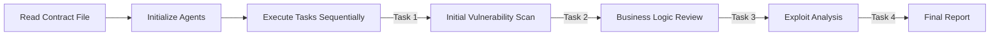

# Crew AI Smart Contract Audit System

## **Overview**
The Crew AI Smart Contract Audit System mimics the process of a real-world audit firm by leveraging a "Crew AI" pattern. This approach involves multiple AI agents, each specializing in distinct areas, working collaboratively to deliver a comprehensive audit of a given smart contract.

---

## **Setup Instructions**

1. Create a virtual environment:
   ```bash
   python -m venv venv
   ```

2. Activate the virtual environment:
   ```bash
   source venv/bin/activate
   ```

3. Install dependencies:
   ```bash
   pip install -r requirements.txt
   ```

4. Run the main program:
   ```bash
   python3 main.py
   ```
5. Dont forget to add .env file with OPENAI_API_KEY
---

## **System Architecture**

### **1. Agents**
The system comprises six specialized AI agents, each with a specific focus:

- **Lead Smart Contract Auditor**: Manages the audit process and oversees the team.
- **Security Vulnerability Expert**: Identifies security weaknesses and potential exploits.
- **Business Logic Analyzer**: Reviews the contract’s logic to ensure compliance with intended functionality.
- **On-Chain Data Analyst**: Analyzes blockchain data patterns for anomalies and insights.
- **White Hat Hacker**: Simulates exploits to test the contract’s robustness.
- **Documentation Specialist**: Compiles findings into a professional audit report.

Each agent operates independently using their own LLM (GPT-3.5 or GPT-4) and communicates findings to the rest of the team.

---

### **2. Process Flow**

The system follows a sequential process where tasks build upon the output of previous tasks. Below is a high-level workflow diagram:



#### **Detailed Steps:**
1. **Setup:**
   - Loads environment variables (e.g., `OPENAI_API_KEY`).
   - Reads the smart contract code from `test.sol`.

2. **Task Execution:**
   Each task is executed sequentially, with outputs passed forward:
   ```python
   task1 = tasks.initial_vulnerability_scan(security_expert, contract_code)
   task2 = tasks.business_logic_review(business_analyst, contract_code, f"{task1.output}")
   task3 = tasks.exploit_scenario_analysis(white_hat, contract_code, f"{task1.output}\n{task2.output}")
   task4 = tasks.final_report_compilation(doc_specialist, f"{task1.output}\n{task2.output}\n{task3.output}")
   ```

3. **Crew Coordination:**
   The **Crew** class manages agent communication and task dependencies:
   ```python
   crew = Crew(
       agents=[security_expert, business_analyst, white_hat, doc_specialist],
       tasks=[task1, task2, task3, task4],
       verbose=True
   )
   ```

4. **Output:**
   The final output is a detailed security audit report, combining findings from all stages and formatted by the Documentation Specialist.

---

## **Features**

1. **Sequential Dependencies**: Tasks build on the outputs of previous tasks, ensuring a logical flow of analysis.
2. **Specialized Expertise**: Each agent focuses on a specific aspect of the audit process, mirroring real-world practices.
3. **Error Handling**: Checks for missing files, API key configuration issues, and other potential errors.
4. **Verbose Output**: Provides real-time tracking of the audit’s progress for greater transparency.

---

## **Output**
The final output is a comprehensive report, including:
- Identified vulnerabilities and security risks
- Business logic inconsistencies
- Simulated exploit scenarios
- Recommendations for improvement

This report ensures thorough coverage and actionable insights for securing smart contracts.
